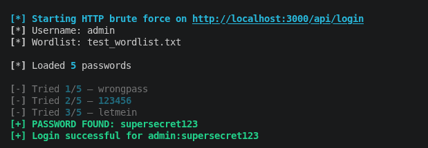
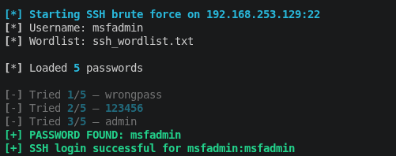

# Password Auditor

A Python tool for testing password strength through automated brute force attacks against HTTP login forms and SSH services.

## Features
- HTTP login form brute forcing with custom field names
- SSH password cracking via paramiko
- Multi-threaded support for high-speed attacks
- Rich colored output with progress tracking
- Wordlist-based password testing

## Installation
```bash
pip install -r requirements.txt
```

## Usage

### HTTP Brute Force
```bash
python3 auditor.py --url http://target.com/login --username admin --wordlist wordlist.txt --fail-text "Invalid"
```

### SSH Brute Force
```bash
python3 ssh_auditor.py --host 192.168.1.100 --username user --wordlist wordlist.txt --port 22
```

## Example Results

### HTTP Login (SecureBank)
Cracked admin credentials by testing 4 passwords from wordlist — found `supersecret123` on attempt 4.



### SSH Login (Metasploitable2)
Cracked msfadmin account on real target — password found on attempt 4 using default credentials.



## Tools Used
- paramiko — SSH protocol implementation
- requests — HTTP requests
- rich — terminal output formatting

## Use Cases
- Penetration testing — password auditing on authorized targets
- Security research — identifying weak credential policies
- Educational labs — understanding brute force attack methodology

> **Disclaimer:** This tool is for authorized security testing only. Unauthorized access to computer systems is illegal.

